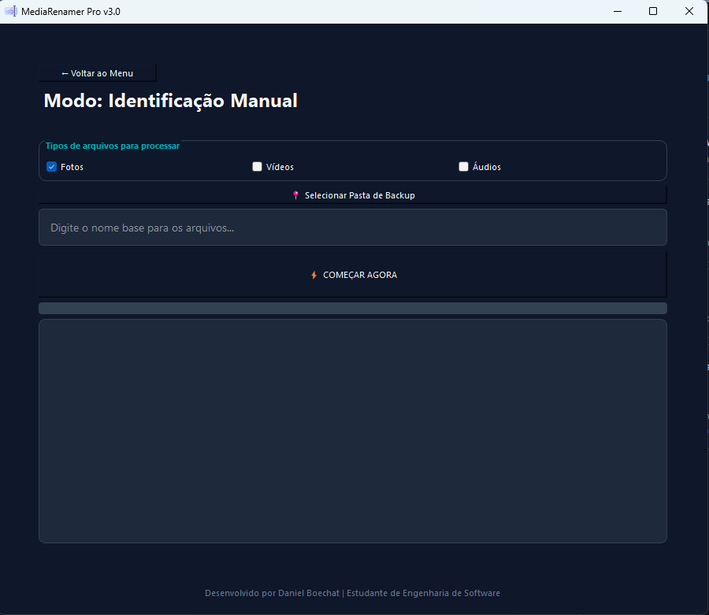

# 📸 MediaRenamer Pro v3.0

O **MediaRenamer Pro** é uma ferramenta de automação desenvolvida em Python para organizar grandes volumes de fotos, vídeos e áudios. Ele utiliza metadados (EXIF) e inteligência de contexto de pastas para renomear arquivos de forma padronizada, ideal para fotógrafos e organização de backups pessoais.

## 🚀 Funcionalidades

- **Dois Modos de Operação:**
  - **Modo Pasta Pai:** Extrai o nome do evento/local diretamente do nome da subpasta (ex: extrai "Viagem" de `(2025-01-01) - Viagem`).
  - **Modo Manual:** Permite definir um nome personalizado via interface.
- **Suporte Multi-mídia:** Filtros inteligentes para processar apenas Fotos, Vídeos ou Áudios.
- **Extração de Metadados:** Tenta obter a data real da captura via EXIF; caso não exista (como em vídeos), utiliza a data de modificação do sistema.
- **Interface Moderna:** Desenvolvida em PyQt5 com layout dark mode e navegação por tiles.
- **Segurança:** Sistema automático para evitar a sobrescrita de arquivos com nomes duplicados.

## 🛠️ Tecnologias Utilizadas

- **Linguagem:** Python 3.x
- **Interface Gráfica:** PyQt5
- **Processamento de Imagem:** Pillow (PIL)
- **Manipulação de Sistema:** OS, Sys, Datetime

## 🖼️ Demonstração



## 📋 Pré-requisitos

Antes de começar, você precisará ter instalado em sua máquina:
- [Python 3.8+](https://www.python.org/downloads/)
- Pip (Gerenciador de pacotes do Python)

## 🔧 Instalação e Execução

1. Clone o repositório:
```bash
git clone [https://github.com/DanielBoechatSantos/RenameFiles.git](https://github.com/DanielBoechatSantos/RenameFiles.git)